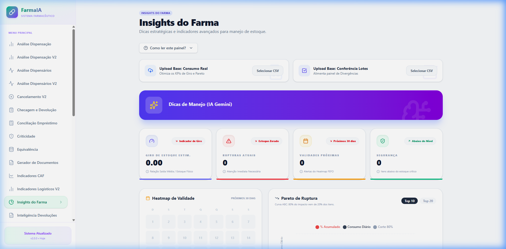
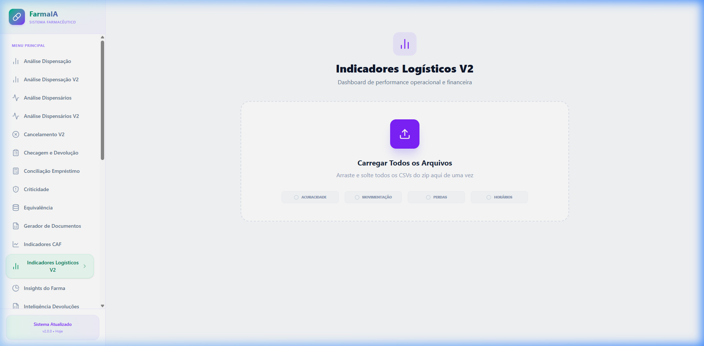
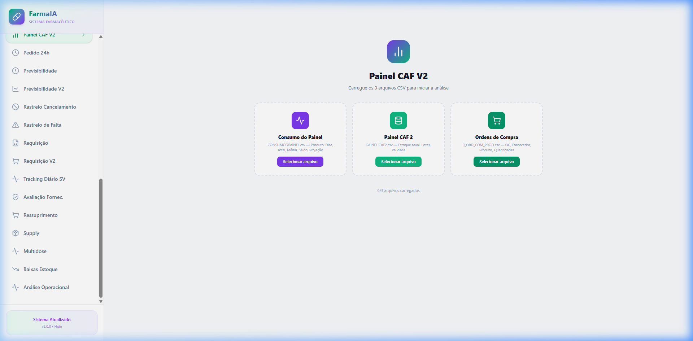
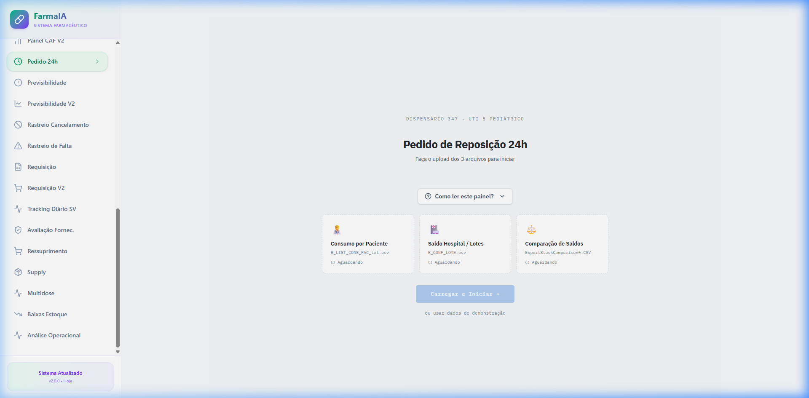
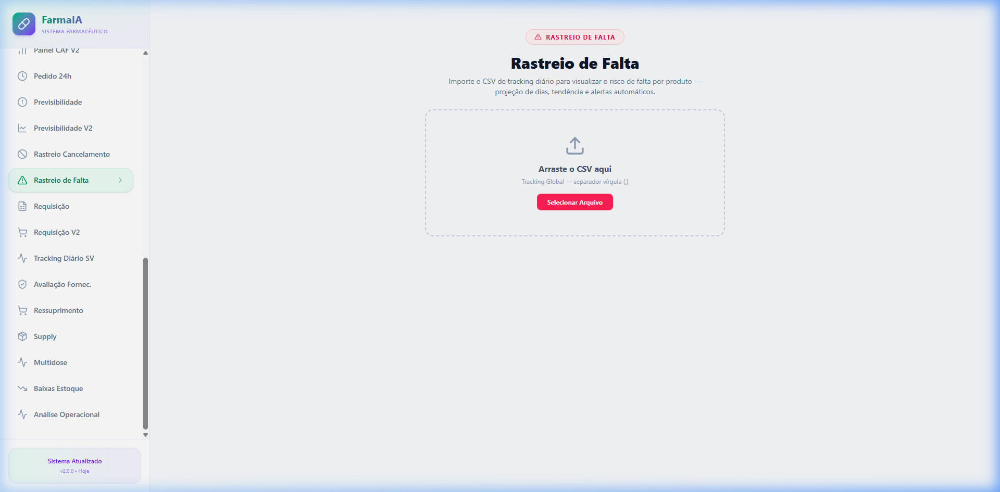

# Apresentação: Logística Farma IA
**Gestão Inteligente de Estoque Hospitalar e Farmacêutico**

---

## 1. Finalidade do Aplicativo
O **Logística Farma** é uma solução avançada projetada para transformar dados logísticos brutos em inteligência operacional. Seu objetivo principal é otimizar a gestão de estoques (CAF e Dispensários), prevenir perdas por validade, evitar rupturas de estoque e garantir que o medicamento certo esteja disponível no momento certo para o paciente.

### Principais Objetivos:
- **Redução de Perdas:** Monitoramento rigoroso de validades (FEFO).
- **Eficiência Operacional:** Automação de cálculos de ressuprimento e pedidos.
- **Visibilidade 360º:** Dashboards em tempo real com KPIs críticos.
- **Segurança do Paciente:** Prevenção de rupturas em itens críticos e sugestão de equivalências.

---

## 2. Visão Estratégica: Insights do Farma
O "coração" analítico do sistema, onde a IA e algoritmos de giro de estoque se encontram.

| Funcionalidade | Descrição |
| :--- | :--- |
| **Giro de Estoque** | Cálculo automático da relação Saída Média vs Estoque Físico. |
| **Rupturas Atuais** | Alerta imediato de itens com saldo zero e demanda ativa. |
| **Heatmap de Validade** | Calendário visual dos próximos 30/60/90 dias de vencimentos. |
| **IA Gemini** | Dicas estratégicas geradas por inteligência artificial para manejo de estoque. |

---

## 3. Indicadores Logísticos V2
Uma visão profunda sobre a performance da operação logística e financeira.

- **Acuracidade do Inventário:** Comparativo entre sistema e físico.
- **Movimentação Financeira:** Valorização do estoque e perdas.
- **Análise de Pico:** Identificação de horários de maior demanda para ajuste de escala.

---

## 4. Gestão da Central de Abastecimento (Painel CAF V2)
Integração completa de dados para o farmacêutico logístico.

- **Cruzamento de Dados:** Consolida Consumo, Saldo e Ordens de Compra (OC).
- **Sugestão de Compras:** Baseada na cobertura de dias desejada (ex: 7, 15 ou 30 dias).
- **Status de Itens:** Classificação automática em Críticos, Alerta ou Seguro.

---

## 5. Operação e Ressuprimento (Pedido 24h & Inteligência)
Agilidade no abastecimento das farmácias satélites e unidades hospitalares.

- **Automação de Pedidos:** Sugestão quantitativa baseada no consumo real das últimas 24h.
- **Saldos Hospitalares:** Visão consolidada de todos os estoques periféricos.
- **Ressuprimento Inteligente:** Prevenção de "stock-out" através de algoritmos preditivos.

---

## 6. Rastreio de Falta e Segurança
Monitoramento proativo para evitar impactos na assistência ao paciente.

- **Dashboard de Ruptura:** Visualização de itens solicitados mas não atendidos.
- **Dias de Cobertura:** Projeção de quando o estoque atual se esgotará.
- **Análise de Tendências:** Identificação de falhas recorrentes por setor ou fornecedor.

---

## 7. Conclusão
O **Logística Farma IA** não é apenas um visualizador de dados, mas uma ferramenta de **tomada de decisão**. Ele elimina o trabalho manual de planilhas complexas e fornece insights acionáveis que garantem a sustentabilidade financeira e a excelência assistencial da farmácia hospitalar.

---

> **Dica:** Para visualizar este arquivo com as imagens, certifique-se de que as imagens (.png) estão na mesma pasta que este arquivo .md.
